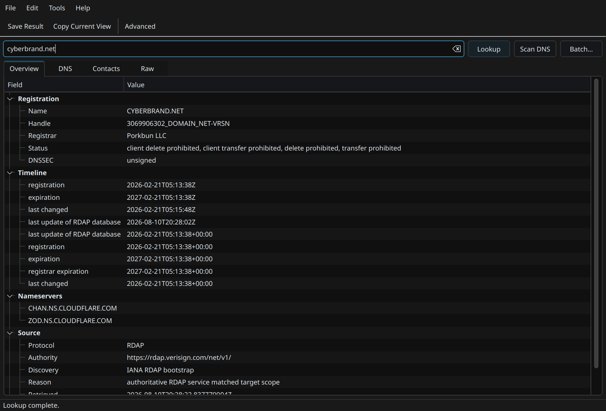
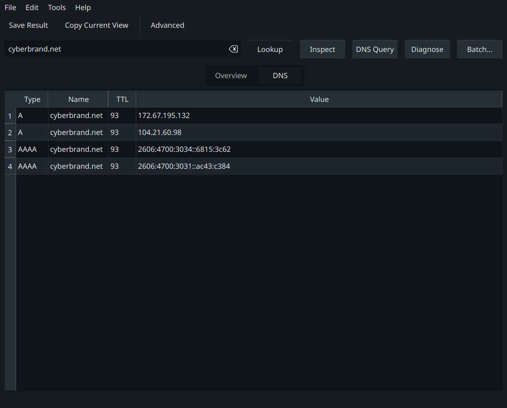
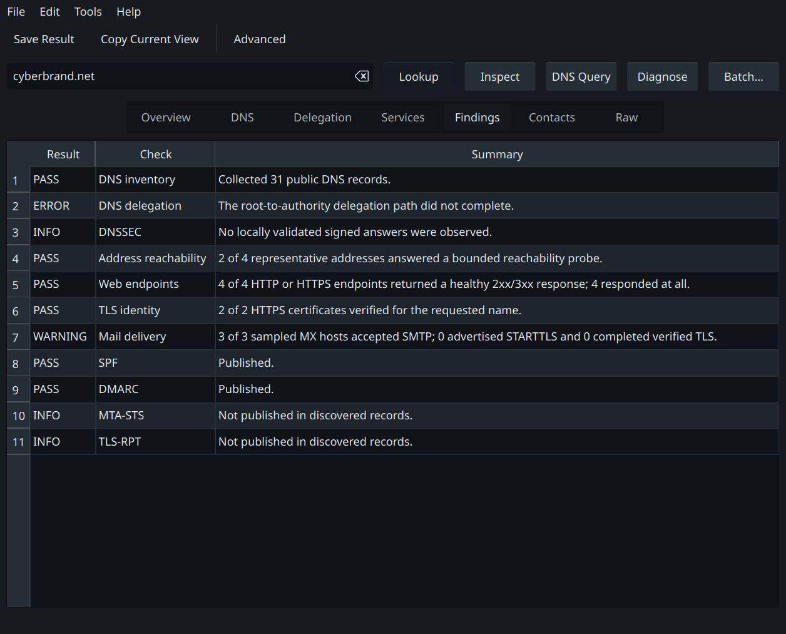
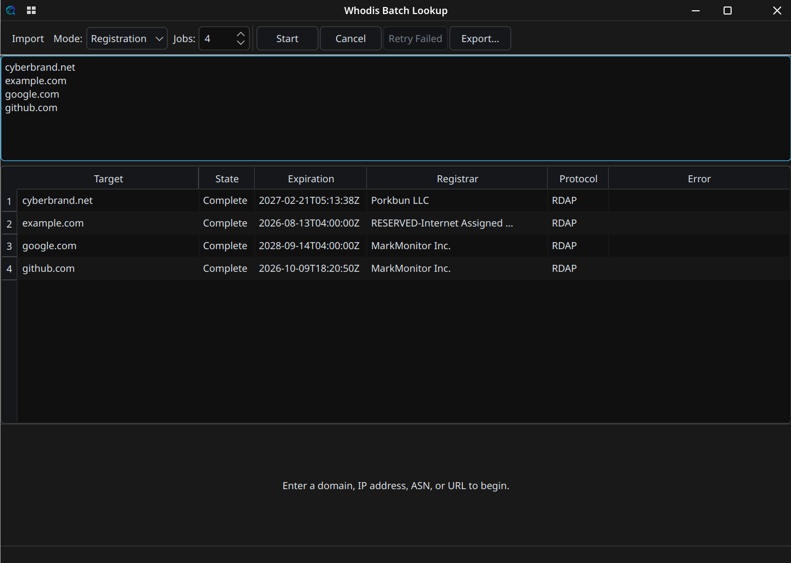

<p align="center">
  
</p>

<h1 align="center">whodis</h1>

<p align="center">
  <strong>A WHOIS alternative that actually understands modern domain infrastructure.</strong><br>
  Whodis starts with authoritative RDAP, falls back to WHOIS when needed, follows RWhois referrals, and turns the result into something you can read.
</p>

<p align="center">
  <a href="https://github.com/Alex9001/whodis/actions/workflows/ci.yml"></a>
  <a href="https://github.com/Alex9001/whodis/releases/latest"></a>
  <a href="https://github.com/Alex9001/whodis/releases"></a>
  <a href="LICENSE"></a>
  
</p>

<p align="center">
  <a href="https://cyberbrand.net/whodis/">Homepage</a> ·
  <a href="https://github.com/Alex9001/whodis/releases/latest">Download</a> ·
  <a href="#install">Install</a> ·
  <a href="#quick-start">Quick start</a> ·
  <a href="https://github.com/Alex9001/whodis/issues">Issues</a>
</p>

Classic `whois` gives you a protocol-era text dump. Whodis accepts a
domain, IP address, network, or ASN, discovers the right RDAP, WHOIS, or RWhois
authority, and organizes the answer into a responsive terminal dashboard. It
also grows into a full domain workstation when you need it: inventory DNS,
compare resolvers, verify DNSSEC, trace delegation, diagnose web and mail
service, profile a site's technology and infrastructure with explainable
evidence, save snapshots, detect changes, enforce health policy, or export a
stable machine-readable report.

## Output made for humans—and scripts

- **Responsive terminal dashboard** — a spreadsheet-like panel grid that uses
  the available width without repeating contacts, notices, or nameservers.
- **Multiple personalities** — dashboard, semantic tree, retro GeekBoys ASCII,
  and portable plain text are one switch away.
- **Structured output** — versioned JSON/YAML, one-row-per-target CSV, and
  streaming-friendly NDJSON support automation; Markdown makes a portable
  report.
- **Focused batch tables** — check many targets, select fields such as
  expiration and registrar, and write directly to a file.
- **Raw source access** — preserve the original RDAP JSON, WHOIS, or RWhois
  response when one unmodified registration lookup is what you need.
- **Native desktop workbench** — Lookup, DNS Inventory, DNS Query, Compare,
  Delegation, Diagnose, Stack, Related, Services, Findings, Contacts, and Raw
  views without a browser or a separately installed CLI. Result columns are
  adjustable and remembered per view, while long values wrap instead of being
  clipped or forcing the whole layout sideways.

## See it in action

<p align="center"><strong>Registration overview</strong> · Live RDAP lookup for <code>cyberbrand.net</code></p>



<table>
  <tr>
    <th width="50%">DNS query</th>
    <th width="50%">Domain diagnosis</th>
  </tr>
  <tr>
    <td></td>
    <td></td>
  </tr>
</table>

<p align="center"><strong>Concurrent batch lookup</strong> · Check and export many domains in one run</p>



The terminal dashboard rearranges the same normalized data into a wide mosaic
or a narrow single-column view. Long registry notices are deduplicated and
summarized; `--details` expands them.

## Install

Whodis releases two independent applications from one codebase:

- `whodis` is the small CLI for shells, scripts, SSH sessions, and servers.
- `whodis-gui` is the native desktop app. It bundles a private Whodis engine
  and does not require the CLI on `PATH`.

### Linux and macOS CLI

```bash
curl -fsSL https://github.com/Alex9001/whodis/releases/latest/download/install.sh | sh
```

The installer detects the operating system and CPU, verifies SHA-256 against
the release checksums, and installs `whodis` into `/usr/local/bin`. It asks for
`sudo` only when the destination is not writable.

### Windows CLI

Run this in PowerShell; an administrator window is not required:

```powershell
irm https://github.com/Alex9001/whodis/releases/latest/download/install.ps1 | iex
```

The installer verifies the archive, installs under local application data, and
adds the directory to the user `PATH`. Open a new terminal and type `whodis`.

### Go, archives, and Arch Linux

```bash
go install github.com/Alex9001/whodis/v2/cmd/whodis@latest
```

Prebuilt CLI archives are published for Linux, macOS, Windows, FreeBSD, and
OpenBSD on amd64 and supported arm64 targets. Source-built AUR definitions for
`whodis` and `whodis-gui` are ready; the maintainer's one-time account and key
steps are in [AUR_HANDOFF.md](AUR_HANDOFF.md).

Each release also carries installable `.deb`, `.rpm`, Alpine Linux `.apk`, and
Arch Linux packages. An optional non-root multi-architecture container is
published to GitHub Container Registry:

```bash
docker run --rm ghcr.io/alex9001/whodis example.com
```

Checksum-pinned Homebrew, Scoop, and Nix manifest generation is ready for
package-channel publication; see [PACKAGING_HANDOFF.md](PACKAGING_HANDOFF.md).
The README does not claim a channel is live until its upstream page exists.

### Desktop app

Download `whodis-gui` from the
[latest GitHub Release](https://github.com/Alex9001/whodis/releases/latest):

- **Linux:** run the amd64 or arm64 AppImage.
- **Windows:** use the per-user setup executable or portable ZIP.
- **macOS:** open the universal DMG and drag Whodis into Applications.

Desktop packages are not code-signed or notarized. Windows SmartScreen and
macOS Gatekeeper will warn on first launch. Verify the published SHA-256
checksum or GitHub build attestation, then use **More info → Run anyway** on
Windows or **Open Anyway** in macOS Privacy & Security settings.

## Quick start

Registration stays effortless:

```bash
whodis google.com
whodis 8.8.8.8
whodis AS15169
```

Ask for the operation you want when you need more:

```bash
# Registration plus a practical public-DNS inventory, including MX
whodis inspect example.com

# DNS inventory without registration data
whodis dns inventory example.com

# Arbitrary DNS types or numeric TYPE values
whodis dns query example.com A AAAA MX HTTPS TYPE257

# Compare normalized answers from recursive and authoritative resolvers
whodis dns compare example.com A

# Follow delegation iteratively from a root server
whodis dns trace example.com NS

# Bounded DNS, reachability, HTTP, TLS, SMTP, and mail-policy checks
whodis diagnose example.com

# Explainable technology, provider, and network attribution from public evidence
whodis investigate example.com

# Explicitly add OTX passive-DNS history and live-check returned hostnames
WHODIS_OTX_API_KEY=... whodis investigate example.com --enrich otx

# Save a passive observation, compare it later, and enforce health policy
whodis inspect example.com --save --label production
whodis diff production --live
whodis check example.com --scrutiny strict
```

## A full DNS client, not a decorative lookup

`whodis dns query` accepts named or numeric record types and classes. Resolver
URIs select the transport explicitly:

| Resolver form | Transport |
|---|---|
| `system`, `1.1.1.1`, `udp://1.1.1.1` | UDP with automatic TCP retry on truncation |
| `tcp://1.1.1.1` | DNS over TCP |
| `tls://dns.example` or `dot://…` | DNS over TLS |
| `https://…/dns-query` | DNS over HTTPS |
| `h3://…/dns-query` | DNS over HTTP/3 |
| `doq://dns.example` | DNS over QUIC |
| `sdns://…` | DNSCrypt stamp |

Responses retain header flags, timing, transport, resolver identity, answer,
authority, additional records, raw wire bytes, EDNS Extended DNS Errors, and a
DNSSEC state. EDNS controls include buffer size, DO, NSID, explicit ECS,
cookie, padding, checking-disabled, and recursion behavior.

```bash
whodis dns query example.com MX TXT --resolver tls://dns.quad9.net --dnssec

whodis dns compare example.com A \
  --resolver https://cloudflare-dns.com/dns-query \
  --resolver tls://dns.google \
  --strategy consensus

whodis dns transfer example.com --ixfr --serial 12345 --tls
```

Compare ignores TTL and answer order when deciding whether resolvers disagree.
Trace follows referrals from embedded root hints and reports glue, missing glue,
lame delegation, and DNSSEC delegation state. AXFR and IXFR are always explicit,
bounded by a record safety limit, and support TSIG and TLS.

With `--dnssec`, Whodis locally verifies positive signed answer RRsets and their
DNSKEY/DS chain against embedded IANA root trust anchors. It reports `secure`,
`insecure`, `bogus`, or `indeterminate` rather than blindly trusting a
resolver's AD bit.

### Optional worldwide DNS views

Globalping is strictly opt-in because it sends the target and location request
to a third-party service and may consume API quota:

```bash
whodis dns query example.com A --globalping --from US --from Europe --limit 3
whodis diagnose example.com --remote
```

Set `GLOBALPING_TOKEN` when using authenticated quota. Whodis has no telemetry,
account system, or background network activity of its own.

## Diagnose without becoming a port scanner

`whodis diagnose` uses only endpoints derived from the target and its published
configuration. Work is time-bounded and capped:

- DNS inventory with local DNSSEC validation and iterative delegation tracing
- representative IPv4 and IPv6 reachability
- apex and `www` HTTP/HTTPS status and redirect chains
- TLS identity, certificate dates, cipher, version, and ALPN
- sampled MX SMTP greeting, EHLO capabilities, STARTTLS, and TLS verification
- SPF, DMARC, MTA-STS, and TLS-RPT discovery, plus MTA-STS policy retrieval
- DNS-advertised SRV, SVCB, and HTTPS service endpoints
- optional local path trace with `--trace`

Findings are deterministic `pass`, `info`, `warning`, or `error` observations
with evidence. There is deliberately no opaque overall score and no arbitrary
port-range scanner.

## Investigate a site's stack without hand-waving

`whodis investigate` builds on Diagnose and turns bounded public observations
into a quick, renderer-independent stack profile. It combines homepage HTTP
headers and markup, DNS provider patterns, mail records, PTR names, and IP RDAP
registration. Web fingerprints use the MIT-licensed `wappalyzergo` engine.

```bash
whodis investigate example.com
whodis investigate example.com --markdown -o profile.md
whodis investigate example.com --enrich otx --related-limit 50 --json
```

Each detected component has a category, role, `high`/`medium`/`low`
confidence, and the exact bounded evidence behind it. Whodis deliberately
separates a network owner such as Amazon from a managed hosting provider, and
does not call a lone `autodiscover` record Microsoft 365 or cPanel. A compact
summary is followed by evidence tables in terminal output. In the desktop app,
the **Overview** immediately summarizes web technology, server/edge, hosting,
network, DNS, mail, and analytics/security findings. The **Stack** view uses a
clean master/detail layout: select one technology, network, link, or note to
see its wrapped summary and evidence below, without repetitive evidence rows.
The **Related** view keeps passive observations separate from stack claims.

Local investigation is the default. It does not execute JavaScript, crawl the
site, scan arbitrary ports, or contact related domains. A configurable HTTPS
pivot link is displayed for manual use but never opened by the CLI. OTX
passive-DNS enrichment happens only with `--enrich otx`; discovered public web
IPs are sent to that service, returned observations are capped, and their
hostnames are checked against current A/AAAA DNS. `current`, `stale`, and
`unknown` describe that DNS comparison—not ownership or affiliation.

The optional OTX key comes only from `WHODIS_OTX_API_KEY` and is never written
to Whodis configuration, reports, snapshots, or logs. Customize harmless
defaults with `whodis config set related-limit`, `investigation-link`, and
`otx-endpoint`. Enrichment opt-in itself is never persisted.

## Snapshots, change detection, and policy checks

Eligible local observations can be saved as snapshots. Dedicated API-token and
TSIG-secret fields, raw DNS packets, request IDs, and timings are removed before
storage. Local investigation reports can be saved; runs using third-party
enrichment cannot:

```bash
whodis inspect example.com --save --label production
whodis snapshot list
whodis snapshot show production
whodis diff production --live
```

For safety, a live replay does not activate custom registry servers or DNS
resolver endpoints stored in an imported snapshot. If you created and trust
the snapshot, opt in explicitly with `whodis diff production --live
--allow-snapshot-endpoints`.

Diffs are semantic and deterministic: record ordering and TTL churn are ignored
unless `--include-ttl` is requested. A provider failure makes its section
uncertain instead of manufacturing a removal. Exit status `5` means material
changes were found; `6` means the comparison was incomplete.

`whodis check` turns the same reports into CI- and monitoring-friendly policy
results:

```bash
whodis check example.com
whodis check example.com --active --scrutiny strict
whodis check example.com --against production --policy whodis-policy.yaml --json
whodis check --snapshot production
```

The built-in `basic`, `standard`, and `strict` scrutiny levels cover
registration expiry, nameservers, DNSSEC, diagnostic findings, and TLS expiry.
Strict YAML/JSON policies can require registration states, DNS records,
nameservers, MX values, DNSSEC state, certificate lifetime, or allowed diff
paths. Optional webhooks are sent only for failed or unknown checks; their URL
can be read from an environment variable or file to keep it out of shell
history. Start with [examples/whodis-policy.yaml](examples/whodis-policy.yaml).
Snapshots never run in the background.

## Batch checks and files

Most registration and workstation commands accept several targets and preserve
input order while using bounded concurrency:

```bash
whodis expires google.com yahoo.com
whodis get expiration,registrar,status -i domains.txt -o results.txt
whodis diagnose example.com example.net --ndjson -o diagnosis.ndjson
printf 'google.com\nyahoo.com\n' | whodis expires
```

Use `--jobs 1` through `--jobs 32` to control concurrency. Individual failures
remain attributed to their input and do not erase successful results. Existing
files are protected unless `--force` is supplied. `.json`, `.ndjson`, `.csv`,
`.yaml`, `.md`, and `.txt` output names select their formats automatically.
Use `-f/--format` when an extension should not decide. `check` and `diff`
support plain text, JSON, YAML, and Markdown through the same file rules.

## Choose defaults once

Run the interactive wizard:

```bash
whodis config
```

It configures output layout, color, notice detail, DNS resolver and DNSSEC
defaults, investigation link and related-result limit, plus the scrutiny and
passive/active mode used by `whodis check`.
Press Enter to retain a choice or review everything before saving. Direct
commands are available for automation:

```bash
whodis config set format tree
whodis config set resolver 'https://cloudflare-dns.com/dns-query'
whodis config set strategy consensus
whodis config set dnssec on
whodis config set scrutiny strict
whodis config set check-mode passive
whodis config set related-limit 50
whodis config set investigation-link 'https://otx.alienvault.com/indicator/{type}/{value}'
whodis config get resolver
whodis config reset
```

Command-line options always override saved defaults; `--no-dnssec` provides an
explicit one-run override. Generate shell completion with `whodis completion
bash|zsh|fish|powershell`.

## Command shape

```text
whodis <target>
whodis registration <target...>
whodis inspect <domain...>
whodis dns query <name> [TYPE...]
whodis dns inventory <domain...>
whodis dns compare <name> [TYPE...]
whodis dns trace <name> [TYPE]
whodis dns transfer <zone>
whodis diagnose <domain...>
whodis investigate <domain...>
whodis check <target...>
whodis snapshot <list|show|remove|export|import|path> ...
whodis diff <snapshot> <snapshot>|--live
whodis expires <target...>
whodis get <fields> <target...>
```

Add `-f dashboard|tree|geekboys|plain|json|yaml|csv|ndjson|markdown|raw` to
select output (the equivalent long shortcuts also work). `whodis help dns`,
`whodis help diagnose`, `whodis help investigate`, and `whodis help advanced`
document operation-specific controls. The older `scan` and `axfr` spellings remain available for
compatibility.

## How registration routing works

Whodis caches IANA's RDAP bootstrap registries for domains, IPv4, IPv6, and
ASNs. Domain routes use the longest registry suffix; IP routes use the longest
network prefix; ASN routes use the published number ranges. HTTPS endpoints are
preferred and alternate endpoints are tried before changing protocol.

When no RDAP service is published, Whodis asks `whois.iana.org` for the
authoritative WHOIS server and follows a bounded referral chain. It follows a
published `rwhois://` referral automatically. A direct authority can be forced
with `whodis rdap|whois|rwhois ... --server`; RWhois direct mode requires the
server because no global RWhois bootstrap exists.

Automatic routing falls back only for an unavailable or unusable service.
Authoritative not-found and rate-limit responses remain visible. `--try-both`
widens diagnostic fallback and `--strict` disables it.

Automatically discovered RDAP URLs require HTTPS, and automatic RDAP,
WHOIS, and RWhois referrals to private, loopback, link-local, documentation, or
other special-use addresses are blocked. Explicitly managed private registry
infrastructure can opt in per run with `--allow-private`; automatic HTTP RDAP
requires the separate `--allow-insecure-http` exception.

## Go SDK and report schema

The supported public API is renderer-independent. The CLI and GUI both call the
same concurrency-safe `Engine` and provider boundaries:

```go
engine := whodis.NewEngine(whodis.EngineOptions{})
report, err := engine.Run(ctx, whodis.Request{
    Operation: whodis.OperationDNSQuery,
    Target:    "example.com",
    DNS:       whodis.DNSOptions{Types: []string{"A", "AAAA", "MX"}},
})
err = whodis.RenderReport(os.Stdout, report, whodis.FormatJSON, whodis.RenderOptions{})
```

`Report` schema version 5 keeps registration, DNS, diagnosis, investigation,
findings, and provider-scoped errors independent, so one failed registry,
probe, or enrichment does not erase useful results. Schema v5 adds explainable
stack components, network attribution, manual pivot links, and bounded related
observations. Snapshot replay continues to read schema-v4 snapshots.
Diagnostic findings are aggregated once at report level instead of being
duplicated inside the diagnosis payload.
`Engine.RunBatch` preserves input order, while `Engine.RunStream` handles input
incrementally with bounded work and progress callbacks. Registration, DNS,
Diagnose, Investigation, and named Enrichment providers are interfaces for
embedding and deterministic tests.

The native GUI's private newline-delimited JSON-RPC protocol is version 4 and
carries schema-v5 reports through the same operation engine as the CLI, plus
progress, cancellation, short-lived in-memory result tokens, and exports. See
[MIGRATING_TO_V2.md](MIGRATING_TO_V2.md) when upgrading an embedded v1 client.

## Development and release integrity

```bash
git clone https://github.com/Alex9001/whodis.git
cd whodis
go test -race ./...
go vet ./...
go run ./cmd/whodis example.com
```

The desktop build additionally needs CMake, Ninja, Qt 6 Core/Gui/Widgets/Test,
and a C++17 compiler; source builds require Go 1.25 or newer. See
[desktop/README.md](desktop/README.md). Tests use
fixtures and in-memory protocol sessions rather than consuming public registry
or Globalping quota.

Release automation has a non-publishing preflight that cross-builds the pure-Go
CLI and every native desktop bundle before a tag is created. It runs race and
vulnerability checks, generates staged-content SBOMs and SHA-256 checksums,
attests the exact release bytes, and only then publishes them. Releases remain
split into CLI and GUI assets so a server never needs to install Qt.

## Boundaries and honest limitations

- RWhois has no global bootstrap registry. Automatic discovery needs a
  published RDAP `port43` hint or WHOIS `ReferralServer`; otherwise use an
  explicit `rwhois --server` authority.
- DNS inventory checks a maintained set of practical owner names and record
  types; DNS has no universal record-list operation. Only a successful AXFR is
  a complete zone, and most public authoritative servers correctly refuse it.
- Local DNSSEC validation currently validates positive signed answer chains.
  Authenticated denial proofs for NXDOMAIN/NODATA are reported as
  `indeterminate` rather than overstated as secure.
- Path tracing can require operating-system ICMP permissions. Whodis reports a
  scoped warning when the host does not allow the native probe.
- Diagnose samples bounded representative addresses, MX hosts, and advertised
  services. It is evidence collection, not continuous monitoring or an
  exhaustive security audit.
- Technology fingerprints and provider mappings are evidence-backed best
  efforts, not contractual proof. Sites can hide, proxy, or spoof headers and
  infrastructure. Passive-DNS neighbors are historical observations, not
  ownership, customer, or compromise claims.
- Raw source output is limited to one registration response. Multi-target and
  workstation operations use human-readable or structured report formats.
- The desktop batch workspace accepts up to 1,000 targets and retains recent
  exportable results in a bounded in-memory cache. Use CLI NDJSON streaming for
  larger jobs.
- Saved snapshots are local files, not a scheduler or hosted monitoring
  service. Use cron, systemd timers, Task Scheduler, or CI to run checks.
- Authenticated registry accounts, proprietary registry APIs, web scraping,
  generic port scanning, telemetry, mobile apps, and app-store distribution are
  intentionally out of scope.
- Desktop packages are currently unsigned and distributed through GitHub
  Releases; SmartScreen and Gatekeeper may require a deliberate first launch.

## License

MIT © 2026 Aleksandr Oreshkin. See [LICENSE](LICENSE).
